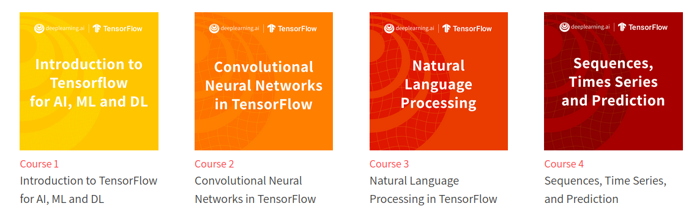

# DeepLearning.AI TensorFlow Developer Professional Certificate program

TensorFlow is one of the most in-demand and popular open-source deep learning frameworks available today. The DeepLearning.AI TensorFlow Developer Professional Certificate program teaches you applied machine learning skills with TensorFlow so you can build and train powerful models.

In this hands-on, four-course Professional Certificate program, you’ll learn the necessary tools to build scalable AI-powered applications with TensorFlow. After finishing this program, you’ll be able to apply your new TensorFlow skills to a wide range of problems and projects. This program can help you prepare for the Google TensorFlow Certificate exam and bring you one step closer to achieving the Google TensorFlow Certificate.

In the DeepLearning.AI TensorFlow Developer Professional Certificate program, you’ll get hands-on experience through 16 Python programming assignments. By the end of this program, you will be ready to:

- Build and train neural networks using TensorFlow
- Improve your network’s performance using convolutions as you train it to identify real-world images
- Teach machines to understand, analyze, and respond to human speech with natural language processing systems
- Process text, represent sentences as vectors, and train a model to create original poetry!

This new DeepLearning.AI TensorFlow Developer Professional Certificate program teaches you how to use TensorFlow to implement those principles so that you can start building and applying scalable models to real-world problems.
